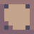
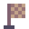

------

**Astromadness** is a puzzle-platformer game by *Lorem Ipsum* with *only one* mechanic, changing gravity. You are a lone astronaut who must use it's portable gravity switcher to navigate the environment, avoid hazards and obstacles and reach the goal at the end of each level.

This game is a submission for the [GMTK 2019 Game Jam](https://itch.io/jam/gmtk-2019) , which has a theme of *"only one"*. 

# Controls

*   **Arrow and "WASD" Keys**: To switch gravity in 4 directions. Keep in mind you will only be able to switch gravity once all objects on the level have stopped moving.
*   **"F" Key**: to toggle fullscreen mode.
*   **"M" Key**: to toggle audio.
*   **"R" Key**: to restart the current level.
*   **"Esc" Key**: to exit the game

# Objects & Hazards

*   **Box**: The box will fall in the direction of gravity, as boxes tend to do.
*   **Balloon**: The balloon will rise opposite to the direction of gravity.
*   **Spikes**: Spikes will hurt you and force you to start the level anew.
*   **Laser**: The laser beam will also hurt you and force you to start again,
*   **Button**: The button will activate/deactivate some spikes and lasers in the level.
*   **Goal**: You must reach the goal in order to progress to the next level.

# Who is *Lorem Ipsum*

The *Lorem Ipsum* team is mainly comprised of two members: Marc Castells ([Castlemark](https://castlemark.github.io)) and Adrià Puigdellívol ([Llivol](https://github.com/Llivol?tab=repositories)), both curently working as game designers and gameplay programmers at [freeverse.io](https://www.freeverse.io).

